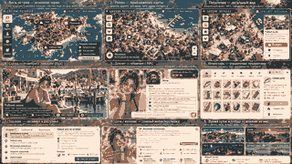

# Visual Bible — ВЛ1: Рейнеке

Статус: Foundation — map direction locked  
Назначение: визуальный канон и рамка для design issues  
Связанный процесс: `docs/DESIGN-ISSUE-CONTRACT.md`

Этот документ фиксирует базовые визуальные правила проекта **«ВЛ1: Рейнеке»**. Он не заменяет отдельные design issues и не определяет заранее каждую деталь. Его задача — не дать интерфейсам, персонажам, локациям и Flux-генерациям разъехаться в разные художественные направления.

Ключевой принцип:

> ВЛ1 должен восприниматься как единый живой мир, а не как набор несвязанных экранов и отдельных AI-картинок.

---

## 1. Что является визуальным каноном

В порядке приоритета:

1. утверждённые решения владельца проекта;
2. этот документ;
3. утверждённые design issues;
4. утверждённые mockup/style frame/concept frame;
5. canonical visual assets внутри игры;
6. текущая реализация UI;
7. случайные результаты генерации.

Случайно удачная Flux-генерация не становится каноном автоматически.

Если новый design issue меняет уже утверждённое правило, изменение должно быть явно зафиксировано в Visual Bible.

---

## 2. Общая визуальная цель

ВЛ1 — реалистичный persistent life-sim о людях, живущих в причинно-связанном мире на острове Рейнеке.

Визуальный язык должен поддерживать четыре ощущения:

- **место существует независимо от игрока**;
- **люди выглядят как жители мира, а не игровые аватары из каталога**;
- **интерфейс помогает наблюдать и действовать, но не заслоняет сам мир**;
- **состояние мира важнее декоративных эффектов**.

Базовое направление до отдельного style exploration:

- grounded;
- contemporary;
- naturalistic;
- utilitarian;
- human-scale;
- slightly weathered;
- без глянцевой sci-fi эстетики.

Это рамка, а не финальный style direction.

---

## 3. Реализм и стилизация

Базовый уровень — **узнаваемый реализм с контролируемой художественной стилизацией**.

Не требуется документальная фотореалистичность любой ценой.

Допустимы:

- кинематографичная композиция;
- аккуратная цветокоррекция;
- подчёркнутая атмосфера погоды;
- слегка упрощённая визуальная подача UI;
- художественная связность между сценами.

Не допускается без отдельного design decision:

- мультяшная деформация пропорций;
- anime/chibi язык;
- high-fantasy;
- cyberpunk/neon как основной стиль;
- glossy mobile-game эстетика;
- гипертрофированный survival-horror;
- визуальная подача, в которой мир выглядит как sci-fi лаборатория.

---

## 4. Рейнеке как место

Остров должен ощущаться конкретным местом, а не универсальной «локацией survival game».

Визуальные признаки:

- море постоянно ощущается частью среды;
- влажный приморский воздух;
- переменчивая погода;
- ветер;
- туман и низкая облачность;
- смешение природного ландшафта и человеческой инфраструктуры;
- следы эксплуатации и ремонта;
- ограниченность пространства и ресурсов.

Важно показывать не только красивые виды, но и функциональные места:

- жильё;
- причал;
- склад;
- кухня;
- мастерская;
- магазин;
- источник воды;
- рабочие зоны;
- маршруты между ними.

### Не превращать остров в

- тропический курорт;
- pristine eco-resort;
- постапокалиптическую пустошь;
- военную базу;
- стерильный smart-city;
- этнографическую деревню из прошлого.

---

## 5. Архитектура и материалы

До отдельного world-design решения архитектура должна строиться вокруг ощущения **практичного, постепенно адаптируемого поселения**.

Предпочтительные признаки:

- дерево;
- металл;
- бетон;
- окрашенные и перекрашенные поверхности;
- простые окна и двери;
- навесы;
- временные пристройки;
- контейнеры и хозяйственные объекты;
- видимые следы ремонта;
- повторное использование материалов;
- функциональные наружные элементы.

Новая постройка не обязана выглядеть старой, но должна ощущаться частью того же мира.

Не следует автоматически использовать:

- luxury minimalism;
- futuristic glass architecture;
- одинаковые prefab-дома без индивидуальности;
- чрезмерно декоративную rustic-эстетику.

---

## 6. Природа и погода

Погода является частью состояния мира и должна визуально влиять на сцену.

Должны быть различимы:

- ясный день;
- облачность;
- дождь;
- сильный ветер;
- туман;
- холод;
- мокрые поверхности;
- вечер;
- ночь.

Погодные эффекты не должны противоречить authoritative state.

Если в мире дождь, visual layer не должен показывать сухую солнечную сцену только потому, что она выглядит красивее.

---

## 7. Люди

Персонажи должны восприниматься как конкретные люди с жизнью вне текущего кадра.

Предпочтительно:

- естественные пропорции;
- индивидуальные лица;
- правдоподобная кожа;
- небольшие несовершенства;
- естественные причёски;
- одежда, соответствующая погоде, работе и образу жизни;
- отсутствие одинаковой «модельной» внешности у всех NPC.

### Возраст

Возраст персонажа должен визуально соответствовать canonical character data.

Нельзя визуально омолаживать или состаривать персонажа ради эстетики.

### Консистентность

Canonical portrait является основным визуальным reference персонажа.

Последующие изображения должны сохранять:

- лицо;
- возраст;
- телосложение;
- волосы;
- ключевые особенности;
- устойчивые элементы внешности.

Одежда и состояние могут меняться в соответствии с authoritative state.

---

## 8. Одежда

Одежда — часть состояния персонажа, а не случайный декоративный prompt.

До отдельного character/fashion design:

- одежда должна выглядеть практичной;
- допустима индивидуальность и субкультурность;
- вещи могут быть новыми, старыми, рабочими, самодельными;
- одежда должна учитывать погоду и занятие;
- worn-state игры имеет приоритет над художественной импровизацией.

Не добавлять в визуал предмет одежды, который система явно считает снятым, если только это не отдельная неканоническая концепт-иллюстрация.

---

## 9. Портреты

Портрет нужен прежде всего для **узнаваемости персонажа**.

Базовые правила:

- один главный персонаж;
- лицо читается;
- нейтральная или контекстная естественная мимика;
- без чрезмерной fashion/editorial постановки;
- без сложного фона, который спорит с лицом;
- освещение правдоподобное;
- изображение пригодно как reference для будущих сцен.

Предпочтительный кадр до отдельного исследования:

- голова + плечи или по грудь;
- камера примерно на уровне глаз;
- естественная перспектива.

Canonical portrait должен выбираться осознанно.

---

## 10. Сцены

Scene generation должна отвечать на вопрос:

> Что сейчас видит или мог бы увидеть наблюдатель в этом месте мира?

Приоритеты:

1. корректная локация;
2. корректные персонажи;
3. корректные объекты;
4. время;
5. погода;
6. текущее событие;
7. художественная композиция.

Красивый кадр не должен исправлять или придумывать факты мира.

### Композиция

В большинстве игровых сцен:

- один понятный визуальный центр;
- читаемая среда;
- человек показан в масштабе пространства;
- фон сообщает что-то о месте;
- интерфейс не встраивается непосредственно в generated scene.

Избегать постоянных extreme close-up и рекламной композиции.

---

## 11. Владивосток

Владивосток пока является внешним условно симулируемым слоем.

Поэтому его визуал не должен создавать ложное ощущение полностью физически симулируемой городской карты.

До отдельного design issue:

- показывать город как внешний контекст;
- использовать более плотную городскую среду;
- визуально отличать материк от Рейнеке;
- сохранять общий реалистичный язык проекта.

---

## 12. UI — общий принцип

UI должен восприниматься как **инструмент наблюдения и управления жизнью**, а не как основное визуальное содержимое игры.

Основная иерархия:

1. где персонаж и что вокруг происходит;
2. что делает персонаж;
3. что с ним происходит;
4. что игрок может сделать;
5. числовые подробности.

Нужно избегать ситуации, где игрок сначала видит dashboard, а уже потом мир.

---

## 13. UI — плотность информации

На одном экране нельзя делать все игровые системы равноправными.

Информация делится на:

### Постоянно важную

Например:

- персонаж;
- место;
- время;
- погода;
- текущая деятельность;
- критическое состояние.

### Контекстную

Например:

- возможные действия;
- находящиеся рядом NPC;
- локальные объекты;
- текущий диалог.

### Справочную

Например:

- подробные числовые needs;
- история событий;
- расширенная экономика;
- debug/administrative information.

Справочная информация не должна визуально конкурировать с миром.

---

## 14. Цвет

До утверждения style direction не фиксируется жёсткая палитра.

Базовые требования:

- интерфейс не должен быть кислотным;
- системные цвета используются функционально;
- опасность, ошибка и критические needs должны отличаться от нейтрального состояния;
- UI должен оставаться читаемым поверх разных визуальных сцен;
- цвет интерфейса не должен конфликтовать с естественной палитрой острова.

Конкретные tokens фиксируются после первого style exploration.

---

## 15. Типографика

До отдельного UI design:

- высокая читаемость;
- поддержка кириллицы;
- небольшое число уровней;
- минимум декоративных шрифтов;
- числа и статусы должны читаться быстро;
- длинные тексты диалогов и биографий должны быть комфортны для чтения.

Конкретное семейство шрифта определяется отдельным решением.

---

## 16. Иконки и декоративные элементы

Иконки должны быть:

- простыми;
- однозначными;
- вторичными по отношению к тексту там, где смысл может быть неочевиден.

Не использовать декоративные игровые рамки, гербы, металлические панели и fantasy HUD без отдельного design decision.

---

## 17. Движение и анимация

Анимация должна объяснять изменение состояния.

Подходящие применения:

- переход между состояниями;
- появление новой информации;
- progress;
- подтверждение действия;
- изменение выбранного объекта.

Не использовать постоянное декоративное движение ради ощущения «живого интерфейса».

---

## 18. Состояния UI

Каждый новый UI design issue должен учитывать применимые состояния:

- normal;
- selected;
- loading;
- empty;
- error;
- disabled;
- unavailable;
- critical.

Нельзя проектировать только happy path.

---

## 19. Generated visuals и UI — разные слои

Flux-изображение не должно содержать:

- игровые кнопки;
- HUD;
- системные подписи;
- числовые needs;
- диалоговые окна;
- псевдо-интерфейс.

Generated visual показывает мир.

Web UI показывает состояние и управление.

Смешивание допускается только в отдельном утверждённом экспериментальном design issue.

---

## 20. Canonical references

Canonical asset — это визуальная часть persistent state.

Приоритет:

- лицо персонажа сохраняется;
- внешний вид объекта сохраняется, если объект объявлен canonical;
- уже утверждённое место не должно радикально менять архитектуру между генерациями;
- новый canonical asset должен заменять старый явно, а не случайно.

Canonical не означает, что все последующие кадры должны иметь одинаковый ракурс или освещение.

---

## 21. Flux prompt discipline

Промпты должны описывать фактическое состояние мира и художественный язык, но не создавать новую игровую истину.

Хороший prompt разделяет:

- identity;
- environment;
- state;
- composition;
- lighting;
- style constraints.

Не использовать случайные детали, которые затем могут ошибочно восприниматься как часть канона.

Если нужна exploratory generation, она должна быть явно обозначена как **non-canonical concept**.

---

## 22. Concept art и canonical art

### Concept

Используется для:

- поиска стиля;
- сравнения направлений;
- обсуждения архитектуры;
- экспериментов с UI;
- выбора визуального языка.

Может противоречить текущему миру.

### Canonical

Используется внутри игры или как утверждённый reference.

Не должен противоречить authoritative state.

Concept не становится canonical автоматически.

---

## 23. Что нельзя решать случайной генерацией

Нельзя отдавать Flux окончательное решение о:

- возрасте персонажа;
- расе/этничности;
- телосложении;
- ключевой внешности;
- архитектуре канонической локации;
- наличии важных объектов;
- текущей одежде, если она задана state;
- времени суток;
- погоде;
- отношениях;
- игровом результате события.

Эти факты должны приходить из канона или authoritative state.

---

## 24. Запрещённые визуальные расхождения

Без отдельного утверждения нельзя:

- менять жанр проекта;
- превращать Рейнеке в sci-fi/fantasy сеттинг;
- делать NPC визуально однородными;
- показывать несуществующие игровые механики как работающие;
- менять географический характер места ради красивого кадра;
- использовать UI, который требует данных, отсутствующих в игре, и выдавать его как финальный implementation-ready mockup;
- считать generated text внутри изображений частью UI design.

---

## 25. Design issue → implementation

Каждый значимый визуальный элемент проходит цепочку:

**визуальное исследование → варианты → выбор → canonical design artifact → implementation issue → реализация → visual smoke-test**

Coding agent не должен самостоятельно выбирать художественное направление при наличии нерешённого design decision.

Если mockup невозможно реализовать без новой механики/API, это должно быть вынесено в отдельную implementation/backend задачу.

---

## 26. Первый этап визуального исследования

До детализации отдельных экранов необходимо провести отдельный `design-visual` issue:

**«Визуальный язык ВЛ1: Рейнеке»**

Цель:

- создать 3–4 достаточно различающихся направления;
- проверить их одновременно на world scene и UI;
- выбрать одно направление;
- зафиксировать выбранные решения здесь;
- после этого открыть D1 «Основной экран мира».

На этом этапе особенно важно не оптимизировать дизайн под ограничения текущего vanilla UI. Сначала определяется правильный пользовательский опыт, затем техническая реализация разбивается на bounded задачи.

---

## 27. Что будет дополнено после style exploration

После утверждения первого design-visual issue сюда должны быть добавлены:

- выбранное название направления;
- reference board;
- точная UI palette;
- typography;
- spacing/radius/border rules;
- icon language;
- базовый layout philosophy;
- portrait framing;
- scene framing;
- архитектурные anchors;
- одежда/материалы;
- lighting rules;
- примеры do/don't;
- ссылки на canonical design artifacts.

До этого момента эти параметры считаются открытыми design decisions.

---

## 28. Каноническое направление карты — Rich Top-Down Geographic Map

Для основной браузерной карты выбран стиль **Rich top-down geographic map**.

Это означает:

- основой служит реальная география острова Рейнеке;
- сохраняется узнаваемый контур береговой линии;
- сохраняются крупные реальные пространственные связи: поселение, причал, основные дороги/тропы и ключевые природные ориентиры;
- карта смотрится богато и атмосферно, но остаётся в виде сверху и хорошо читается как игровое пространство;
- рельеф, растительность, берег, море и застройка могут быть художественно обогащены, если не ломают географическую узнаваемость;
- новые игровые объекты и изменения persistent world накладываются поверх географического каркаса.

Это **не**:

- изометрическая карта;
- pixel-art;
- чистая схема;
- спутниковый снимок как готовый игровой экран;
- бесконечно детализированная физическая 3D-сцена.

При конфликте между декоративностью и читаемостью/производительностью приоритет имеет игровая читаемость.

---

## 29. Визуальная архитектура браузерной карты

Карта проектируется как несколько независимых визуальных слоёв.

### Base world layer

Относительно стабильный визуальный слой:

- берег;
- море;
- рельеф;
- крупные массивы растительности;
- дороги и тропы;
- базовая застройка;
- крупные постоянные landmarks.

Он не должен полностью перерисовываться при каждом игровом тике.

Для реализации допускаются оптимизированные raster/vector tiles и другие браузерные техники, если итог сохраняет канонический вид.

### Dynamic world layer

Отдельный лёгкий слой для изменяемого состояния:

- игроки;
- NPC;
- новые здания;
- стройка;
- маршруты;
- события;
- пожар;
- выделение и выбор объектов;
- временные игровые маркеры.

Динамическое состояние не должно быть «запечено» в базовую карту только ради красоты.

### Ambient layer

Отдельный декоративный слой для дешёвого движения среды:

- ветер в растительности;
- прибой;
- птицы;
- дым;
- огни;
- погодные эффекты.

Ambient layer не меняет canonical simulation state.

### UI layer

HTML/UI остаётся отдельным слоем:

- actions;
- dialogue;
- needs;
- задачи;
- панели персонажа;
- уведомления.

UI не должен быть частью изображения terrain.

### Detailed scene layer

Flux/scene generation используется для детального осмотра места, персонажа или события.

Rich map отвечает за навигацию и постоянное ощущение живого острова; Flux отвечает за крупный атмосферный кадр по запросу.

---

## 30. Уровни детализации карты

Карта должна снижать визуальную и вычислительную плотность на дальнем масштабе.

### Island view

Показываются:

- весь остров;
- крупные зоны;
- основные дороги;
- ключевые локации;
- крупные события;
- положение игрока.

Отдельные NPC и мелкие объекты не обязаны отображаться.

### Region view

Показываются:

- здания;
- маршруты;
- группы/NPC clusters;
- локальные события;
- основные интерактивные точки.

### Settlement / local view

Допускаются:

- отдельные здания;
- отдельные персонажи;
- локальные объекты;
- строительство;
- более подробные environmental effects.

После этого уровня дальнейшее увеличение детализации предпочтительно делать через **осмотр/scene view**, а не через бесконечный zoom карты.

---

## 31. Канон ambient motion

Для основной карты выбран принцип **subtle ambient motion**.

Движение должно создавать ощущение, что остров живёт, но не превращать карту в демонстрацию эффектов.

Правила:

- медленно;
- редко;
- ненавязчиво;
- циклично;
- ограниченно по числу одновременно активных объектов;
- с возможностью деградации качества;
- по возможности связано с authoritative state.

Например:

- сила покачивания растительности может зависеть от ветра;
- дождь появляется только при соответствующей погоде;
- ночные огни появляются в тёмное время;
- дым должен исходить только из подходящих источников/мест.

Декоративные птицы могут быть ambient-эффектом и не обязаны быть полноценными simulation entities, пока птицы не участвуют в gameplay.

---

## 32. Первый набор ambient-эффектов

### Первая очередь

Канонический минимальный набор:

1. **Покачивание деревьев и крупных кустов**  
   Лёгкое движение отдельных групп растительности, а не каждого дерева.

2. **Прибой**  
   Небольшое циклическое движение/пена вдоль видимой береговой линии.

3. **Редкие птицы**  
   Один или несколько силуэтов по редким траекториям, прежде всего у берега и причала.

4. **Дым**  
   Небольшие plume-effects у труб, кухни, костров и подходящих рабочих объектов.

5. **Ночные огни**  
   Ограниченное число светящихся окон и функциональных источников света.

6. **Weather overlays**  
   Дождь, туман и соответствующее изменение общей атмосферы.

### Вторая очередь

После стабилизации основной карты:

- облачные тени;
- слабое движение травы на открытых участках;
- лёгкое покачивание лодок;
- локальные частицы для игровых событий;
- более выразительные fire/smoke effects.

---

## 33. Performance principles для Living Map

Красота карты не должна зависеть от большого числа постоянно обновляемых объектов.

Запрещённый базовый подход:

- отдельный DOM-элемент на каждое дерево, камень или травинку;
- физическая симуляция океана;
- realtime-анимация всей растительности;
- постоянное обновление всего terrain;
- сложные тени для каждого декоративного объекта;
- декоративные эффекты, работающие вне viewport без причины.

Предпочтительный подход:

- максимально стабильный rich base layer;
- изменение только динамических объектов;
- объединение декоративных элементов в группы;
- viewport culling;
- ограниченная частота обновления ambient layers;
- отключение/упрощение эффектов при низкой производительности;
- lazy-loading деталей по масштабу и области карты.

Визуальная система должна иметь минимум три уровня качества:

### High

- полный Rich terrain;
- весь набор ambient effects;
- более высокая плотность деталей;
- плавные погодные overlays.

### Balanced

Основной целевой режим:

- Rich terrain сохраняется;
- эффекты работают с ограниченной плотностью;
- дальние и малозаметные ambient effects сокращаются.

### Low / Mobile

- тот же игровой мир и география;
- сниженная детализация raster/tile assets;
- минимум ambient motion;
- упрощённые погодные эффекты;
- без декоративных эффектов, не влияющих на понимание состояния мира.

Качество графики не должно менять simulation result.

Если пользователь предпочитает reduced motion, ambient animations должны иметь возможность существенного сокращения или отключения.

---

## 34. Зафиксированные и открытые design decisions

### Зафиксировано

- географической основой является реальный остров Рейнеке;
- основная карта — **Rich top-down geographic map**;
- браузерная карта строится слоями;
- rich base terrain отделён от dynamic simulation layer;
- detailed Flux scenes не заменяют карту;
- оживление карты — **subtle ambient motion**;
- первая очередь ambient: деревья, прибой, птицы, дым, ночные огни, weather overlays;
- производительность браузера является ограничением первого класса;
- эффекты должны деградировать по quality preset без изменения игровой логики.

### Пока открыто

- точная цветовая палитра;
- typography;
- финальный UI layout;
- icon language;
- окончательный terrain rendering style;
- точная плотность объектов по zoom level;
- portrait framing;
- visual language dialogue mode;
- конкретные implementation technologies.

Эти решения фиксируются следующими design issues и не должны автоматически приниматься coding agent.

---

## 35. Approved Living Map reference

Статус: **APPROVED — 2026-09-23**

В качестве референсного направления утверждён concept frame **“LIFESIM: REINEKE — Living Map / Rich Top-Down”** из дизайн-сессии 2026-09-23.

Он фиксирует не конкретные пиксели, а следующую визуальную систему:

- остров читается как реальное географическое место;
- вид строго top-down / near-orthographic, без изометрической перспективы;
- terrain богатый и натуральный: море, берег, скалы, поля, лес, дороги, поселение;
- базовая карта визуально цельная и атмосферная;
- gameplay markers и NPC лежат отдельным динамическим слоем;
- UI не запекается в terrain;
- декоративное движение среды отделено от gameplay;
- Flux используется после перехода к объекту/месту, а не как основной map renderer.

При дальнейшем дизайне нельзя возвращаться к pixel-art, изометрии или чистой схеме без нового явного design decision.

---

## 36. Approved browser rendering handoff

Зафиксирована следующая архитектура визуального вывода основной карты.

### Base map

Основной terrain должен поставляться как **tiled raster**:

- предпочтительные форматы: WebP и/или AVIF;
- загружаются только необходимые для текущего viewport/zoom тайлы;
- запрещено делать один гигантский full-resolution bitmap острова как единственный production asset;
- base map не перерисовывается на каждый simulation tick.

Base map содержит только относительно стабильные элементы мира.

### Dynamic layer

Изменяемые игровые объекты выводятся отдельным **Canvas/WebGL layer**:

- игрок;
- NPC;
- динамические здания/стройка;
- маршруты;
- события;
- selection/highlight;
- gameplay markers.

Обновление одного NPC или маркера не должно требовать обновления base map.

### Ambient layer

Ambient motion реализуется отдельным лёгким Canvas/WebGL-слоем или эквивалентным GPU-friendly способом.

Ambient layer может быть визуально связан с погодой и временем, но не владеет simulation state.

### UI layer

Постоянный интерфейс остаётся **HTML/CSS**:

- панели;
- действия;
- needs;
- диалог;
- задания;
- уведомления.

Выбор конкретной JS/WebGL-библиотеки остаётся implementation decision, если она сохраняет эти границы слоёв и performance principles.

---

## 37. Approved zoom / LOD model

Канонический пользовательский путь карты имеет четыре уровня.

### LOD 1 — Island

Весь Рейнеке.

Показываются:

- география острова;
- основные зоны;
- крупные дороги;
- ключевые локации;
- крупные события;
- положение игрока.

Мелкие NPC и декоративные объекты скрываются или агрегируются.

### LOD 2 — Region

Район острова.

Появляются:

- основные здания;
- локальные маршруты;
- группы NPC;
- ресурсы/события, если они релевантны;
- больше environmental detail.

### LOD 3 — Settlement / Local

Поселение или локальная игровая зона.

Показываются:

- отдельные здания;
- отдельные NPC;
- локальные объекты;
- строительство;
- более плотный ambient layer.

### LOD 4 — Object / Scene

Дальнейший zoom карты не является основным способом детализации.

Игрок выбирает объект, персонажа или место и переходит в **detail/scene view**, где может использоваться canonical visual + Flux scene generation.

Формула:

**остров → район → поселение → объект/Flux-сцена**

---

## 38. Approved ambient behavior

Первая production-очередь Living Map:

1. группы деревьев/крупных кустов слегка двигаются от ветра;
2. вдоль видимого берега работает мягкий циклический прибой;
3. редкие птицы пересекают карту короткими проходами;
4. из подходящих источников появляется лёгкий дым;
5. ночью ограниченное число окон/фонарей даёт свет;
6. дождь и туман работают как weather overlays.

Вторая очередь:

- облачные тени;
- лёгкое движение травы;
- покачивание лодок;
- дополнительные event-specific fire/smoke particles.

### Интенсивность

Ambient motion не должен непрерывно привлекать внимание.

По умолчанию:

- эффекты медленные;
- объекты двигаются группами, а не поштучно;
- bird passes редкие;
- дым тонкий и локальный;
- прибой читается только у береговой линии;
- ночное освещение точечное;
- погода может быть заметнее остальных ambient effects, потому что отражает world state.

---

## 39. Approved quality presets

### High

- полный Rich terrain;
- максимальный доступный уровень detail для текущего zoom;
- вся первая очередь ambient effects;
- более плотные foliage/surf/light эффекты;
- плавные weather overlays.

### Balanced

**Основной целевой preset.**

- Rich terrain сохраняется;
- ambient motion сохраняется;
- плотность птиц, foliage motion, дыма и мелких эффектов ограничена;
- off-screen и дальние эффекты агрессивно cull-ятся;
- визуальная идентичность High режима сохраняется.

### Low / Mobile

- география и gameplay markers полностью сохраняются;
- используются более лёгкие tiles/LOD;
- foliage motion минимален или отключён;
- птицы и второстепенные эффекты могут отсутствовать;
- прибой и weather overlays упрощены;
- gameplay state остаётся тем же.

### Reduced motion

При `prefers-reduced-motion` или эквивалентной настройке:

- декоративное движение растительности отключается или резко уменьшается;
- bird passes отключаются;
- surf становится статичным или очень медленным;
- weather state остаётся читаемым без интенсивной анимации;
- никакая игровая информация не теряется.

---

## 40. Browser performance guardrails

Living Map проектируется так, чтобы визуальная насыщенность не зависела от количества постоянно активных browser objects.

Обязательные ограничения:

- загружать только видимые/нужные tiles;
- не обновлять static terrain на каждом simulation tick;
- не создавать DOM-элемент для каждого дерева, камня, волны или частицы;
- не симулировать физику океана;
- не анимировать всю растительность независимо;
- не держать невидимые ambient effects активными вне viewport;
- группировать foliage/surf/particle effects;
- применять viewport culling и LOD;
- обновлять динамические слои по delta/state changes, а не полным redraw всего мира;
- поддерживать падение качества без изменения gameplay.

Ориентир для design/implementation profiling, а не жёсткий benchmark:

- десятки одновременно видимых NPC должны быть обычным случаем;
- сотни лёгких markers не должны требовать смены архитектуры;
- десятки динамических объектов/зданий должны быть штатным сценарием.

Точные FPS, memory и network budgets устанавливаются implementation issue после профилирования.

---

## 41. Living Map design handoff

На этом этапе следующие решения **не требуют повторного художественного выбора coding agent**:

- стиль основной карты: Rich top-down geographic;
- реальная география Рейнеке как skeleton;
- tiled raster base map;
- Canvas/WebGL dynamic layer;
- отдельный ambient layer;
- HTML/CSS UI layer;
- четыре уровня LOD;
- detail/Flux scene после local view;
- ambient first wave;
- High / Balanced / Low-Mobile;
- reduced-motion fallback;
- performance-first culling/LOD principles.

Следующий технический этап должен оформить отдельный implementation issue на **browser Living Map renderer**.

Открытыми остаются:

- конкретная map/render библиотека;
- tile size и packaging;
- точные performance budgets;
- asset production pipeline;
- конкретные shader/animation techniques;
- UI palette/typography/layout;
- портретный и dialogue visual language.

---

## 42. Approved Alpha UI reference

### Canonical visual reference

Утверждённый composite mockup:

Repository asset: [`docs/design/approved/alpha-screen-set-v1.png`](design/approved/alpha-screen-set-v1.png)

Этот PNG является главным визуальным reference для первого implementation-pass экранов. Текстовые требования ниже уточняют поведение и границы, но не заменяют визуальную композицию.

Статус: **APPROVED — 2026-09-24**

Утверждён composite concept screen из дизайн-сессии 2026-09-24 как **implementation target для первого визуального прохода alpha UI**.

Это не pixel-perfect макет и не источник gameplay truth. Он фиксирует визуальный и информационный принцип экранов.

### Целевая аудитория и тон

Основная целевая аудитория интерфейса — женщины.

Пример player-character в утверждённом concept frame:

- женщина;
- 23 года;
- молодой взрослый персонаж;
- визуальная подача мягкая, тёплая, привлекательная и «аппетитная»;
- персонаж должен ощущаться живым, симпатичным и эмоционально доступным;
- интерфейс не должен становиться детским, чрезмерно «розовым» или терять grounded realism проекта.

Это пример visual tone, а не обязательный пол/возраст всех игроков.

---

## 43. Approved screen family

Следующие экраны должны восприниматься как части одной системы.

### 43.1 Весь остров — основной экран

Главный world screen:

- Rich Living Map занимает основное визуальное пространство;
- время и погода всегда быстро читаются;
- ключевые события видны без открытия отдельного dashboard;
- основная навигация компактная;
- UI не перекрывает карту без необходимости.

### 43.2 Район

Zoom/region screen показывает:

- дороги;
- здания;
- NPC;
- события;
- точки интереса;
- локальные действия.

### 43.3 Поселение

Local/settlement screen показывает:

- отдельные здания;
- находящихся рядом NPC;
- заведения;
- интерактивные точки;
- contextual actions.

### 43.4 Scene / Flux view

Детальный visual screen:

- крупная scene image;
- название места;
- краткое описание;
- основные contextual actions;
- возможность начать разговор, торговлю, взять задачу или осмотреть место.

Flux visual не содержит запечённого UI.

### 43.5 Диалог с NPC

Dialogue screen содержит:

- крупное визуальное присутствие NPC/scene;
- имя и роль NPC;
- relationship state;
- контекст разговора;
- предложенные варианты ответа;
- **всегда доступное свободное поле ввода**.

Свободный ввод является обязательной частью интерфейса и не должен прятаться за отдельным advanced mode.

Игрок может написать:

- собственную реплику;
- вопрос;
- намерение;
- contextual action.

Предложенные ответы ускоряют игру, но не заменяют свободный ввод.

### 43.6 Инвентарь

Inventory screen:

- категории;
- сетка предметов;
- подробности выбранного предмета;
- действия use / equip / sell / discard, если они поддерживаются gameplay;
- визуально остаётся лёгким и тёплым, без ощущения ERP-системы.

### 43.7 Задания

Task screen разделяет:

- активные;
- доступные;
- выполненные.

Задача показывает:

- зачем она существует в мире;
- текущий progress;
- связанные NPC/места;
- ожидаемый результат/награду;
- кнопку показать связанный объект на карте, если применимо.

### 43.8 Цель / желание

Отдельный важный экран/раздел player agency.

Игрок имеет свободное текстовое поле:

**«Чего ты хочешь для своего персонажа?»**

Примеры:

- «Хочу завести отношения»;
- «Хочу стать мэром»;
- «Хочу открыть своё дело»;
- «Хочу стать самым известным человеком на острове»;
- «Хочу построить большой дом»;
- «Хочу жить спокойно и никуда не спешить».

Это не обычный quest input.

Это **глобальный мотив персонажа**, который используется системой для создания естественных возможностей внутри мира.

---

## 44. Goal / Desire — product principle

Система «Цель / желание» является одной из ключевых особенностей ВЛ1.

Принцип:

> Игрок формулирует желание свободным текстом, а мир старается создать правдоподобную цепочку возможностей, NPC-реакций, событий и задач, через которую это желание может реализоваться внутри существующей симуляции.

Желание не должно исполняться мгновенной магической мутацией state.

Вместо этого система должна:

1. интерпретировать намерение;
2. определить возможный социальный/gameplay путь;
3. найти подходящих NPC, роли, локации и игровые системы;
4. создать или усилить правдоподобные opportunities;
5. предложить игроку действия;
6. оправдать развитие событий внутри мира.

### Пример: отношения

Игрок пишет:

> «Хочу завести отношения».

Мир может:

- чаще создавать социальные возможности;
- знакомить персонажа с подходящими NPC;
- создавать совместные бытовые события;
- давать естественные поводы для общения;
- развивать отношения через существующие relationship mechanics.

Это не означает принудительное изменение чувств конкретного NPC без игрового основания.

### Пример: стать мэром

Игрок пишет:

> «Хочу стать мэром».

Мир может построить цепочку:

- общественно заметное достижение;
- повышение familiarity/respect;
- NPC предлагают активнее участвовать в жизни общины;
- появляется общественная роль;
- возникает повод для выборов/назначения;
- игрок получает возможность принять участие;
- дальнейший исход обосновывается событиями мира и выбранной fantasy продукта.

Конкретная механика выборов должна быть отдельной gameplay implementation, если её ещё нет.

### Важное ограничение

Goal/Desire layer **направляет генерацию возможностей**, но не получает право напрямую произвольно менять canonical state.

Все итоговые изменения проходят через существующие или специально добавленные authoritative mechanics.

---

## 45. Social roles — world-wide perception

У каждого player-character должна существовать **социальная роль или набор социально значимых ролей**, воспринимаемых окружающим миром.

Примеры ролей:

- новичок;
- строитель;
- рыбак;
- владелец бизнеса;
- организатор;
- врач;
- общественный лидер;
- партнёр другого персонажа;
- мэр;
- нарушитель;
- уважаемый житель.

Роль — не просто badge в UI.

Она должна быть доступна как context для:

- NPC decision making;
- dialogue;
- relationships;
- social events;
- доступных предложений;
- reputational reactions;
- Goal/Desire planning;
- других игроков там, где это предусмотрено gameplay.

### Role visibility

UI должен позволять игроку понять:

- кем его персонажа сейчас воспринимает мир;
- какие роли активны;
- откуда роль появилась;
- какие социальные последствия она имеет.

Не каждая внутренняя характеристика должна быть публичной ролью.

---

## 46. Player agency model

Для UI/UX ВЛ1 фиксируется три уровня player agency:

### Immediate action

Игрок делает конкретное действие сейчас:

- пойти;
- поговорить;
- использовать;
- купить;
- работать;
- осмотреть.

### Freeform interaction

Игрок пишет свою реплику или contextual intent в диалоге.

### Long-term desire

Игрок описывает глобальное направление жизни персонажа.

Формула:

**действие → свободное намерение → жизненная цель**

Игра должна поддерживать все три уровня, а не заставлять игрока выбирать только из заранее заданных кнопок.

---

## 47. Approved UX rule for free text

Свободный текст является first-class input.

Он применяется минимум в:

- Dialogue;
- Goal / Desire.

UI обязан:

- всегда визуально показывать возможность свободного ввода;
- не создавать впечатление, что preset buttons — единственный способ взаимодействия;
- показывать статус обработки;
- возвращать понятный ответ/результат;
- не скрывать факт, когда система не смогла интерпретировать намерение.

Preset options остаются shortcut-механикой.

---

## 48. Implementation handoff — approved alpha screens

Для первого implementation-pass coding agents могут считать утверждёнными следующие design decisions:

- общий мягкий, тёплый и привлекательный visual tone;
- female 23-year-old example character как основной reference для mockups;
- Rich Living Map как world screen;
- map → region → settlement → scene flow;
- scene view с contextual actions;
- dialogue view с relationship context;
- **обязательное free-text поле в dialogue**;
- inventory layout;
- tasks layout;
- отдельный Goal / Desire screen;
- free-text long-term desire;
- role-aware world context;
- time/weather visual states.

Не зафиксированы окончательно:

- exact pixel spacing;
- font family;
- окончательные color tokens;
- конкретные mobile breakpoints;
- точная API/schema для Goal/Desire;
- конкретный implementation social-role model;
- алгоритм world adaptation;
- election/business/romance content pipelines.

Последние пункты должны идти отдельными implementation/gameplay issues, а не решаться UI-разработчиком самостоятельно.
